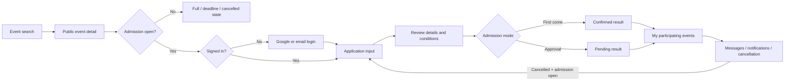
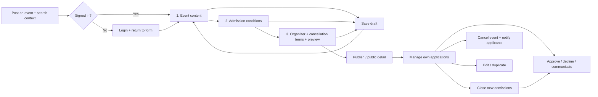
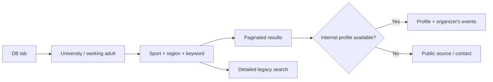

# Circle Match UX fixes (2026-09-28)

## Scope

Follow-up to the walkthrough of commit `244d80a`. Existing images, public URLs,
authentication providers and source datasets are retained. The uncommitted
`outputs/public_circles_seed.csv` changes are not part of this release.

## Resolved findings

- Closing admissions or reaching the application deadline no longer prevents
  reviewing existing pending applications before the event starts. Capacity is
  still checked inside the SQLite write transaction.
- Event cancellation takes precedence over the applicant's old acceptance state.
- The host can read the original application message and team representative.
- Cancelled applicants retain their conversation and can reapply while admission
  remains open. Previous answers are archived privately; duplicate active
  applications and rejected-application resubmission remain blocked.
- Full, expired and cancelled events stop applicants before form entry. Capacity
  is checked again on submission to handle concurrent requests.
- Applications now have input, review and result views, with dates, fees, payment,
  participation and cancellation terms repeated at review time. Approval pending
  is explicitly different from confirmed attendance.
- The host form validates each step, focuses invalid fields, supports partial
  drafts and previews all material event and admission terms before publication.
- Region, prefecture and sport context survive posting/login navigation. Personal
  and team participation labels are Japanese. Previous team information can be
  reused by its account owner.
- Mobile sport images use two columns and there is a direct list jump. Mobile DB
  rows retain sports and source links. The DB has 24-row pagination and shareable
  page/filter URLs instead of an un-navigable first page.
- DB entries without an internal profile lead to the original public source or
  the correction/contact route, rather than a dead-end placeholder.
- Ten exact source records flagged in the walkthrough are withheld pending review,
  without deleting or changing their original names. This is not a claim that the
  entire dataset has been reviewed. Public labels describe information provenance,
  not identity/representative authorization.
- Notifications link to event details and support recipient-scoped read status.
  Host confirmation counts refresh after approval; actions use confirmation dialogs.

## Current participant flow



## Current host flow



Login remains before the host form, following the user's subsequent request to
encourage reusable basic information. Existing unfinished input in the same tab
is restored if authentication expires during saving.

## Current DB flow



## Verification

All automated checks below passed against disposable SQLite databases, with no
production application or participant mutation:

- `python scripts/test_event_ux.py`: 12 regression tests, including concurrent
  reapplication, notification ownership, quarantine restoration and embedded JS parsing.
- `python scripts/test_event_capacity_email.py`: 10 tests including team capacity,
  concurrent final slot, email enqueue/retry/failure, and message authorization.
- `python scripts/test_account_navigation.py`: 3 tests.
- `python scripts/test_event_flow.py`: domain, HTTP, permissions and migrations.
- `node scripts/test_signin.cjs`: login flow checks.
- Python compilation and `git diff --check`.

Browser walkthrough used isolated dummy accounts: individual application and
confirmation, cancellation and messaging after cancellation, team application and
pending result, closing admissions before approval, confirmed-team count refresh,
event cancellation and participant notification/read state, partial draft,
validation, preview and publication. DB pagination/search and 390px/1366px layouts
were checked. The email provider was mocked in regression tests; real Google
consent and live notification delivery were not repeated in this release.

## Data changes and recovery

Two additive tables are created at startup: `event_application_history` and
`circle_listing_reviews`. No existing table or original circle row is deleted.
The existing persistent database path and SQLite migration/backups are retained.

The exact source URL list in `LISTING_REVIEW_SOURCES` adds pending review records
idempotently. Only pending review records are excluded from public search,
statistics and profile display. After checking a source, an operator can restore
one record with a parameterized statement:

```sql
UPDATE circle_listing_reviews SET review_status = 'approved' WHERE circle_id = ?;
```

Startup does not overwrite an existing review decision. Before a manual DB change,
take a consistent SQLite backup via the backup API, not a raw copy of a live WAL
database. Code rollback need not drop these additive tables; retain history and
review decisions. Rolling back to code without the review filter would make
pending records public again, so prefer a forward correction.
